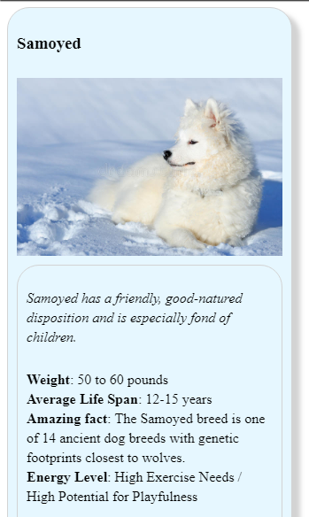
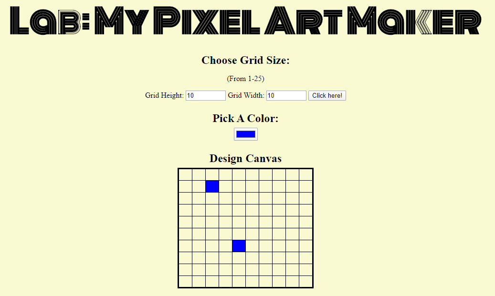

# **Intro to Programming Nanodegree (Udacity, 2020)**

A repository for the projects that I have done during my Udacity **Intro to Programming Nanodegree**.

___

## **Project 1:** <a href="https://codepen.io/dimitraK/full/rprEzy/" target="_blank">**Animal Trade Card**</a>

An **exercise** to use what I have learned about **CSS** to **convert** a design prototype into a functional webpage. The design prototype used in this project is inspired by trading cards and features the animal of my choice.

GitHub repository: <a href="https://github.com/dimikara/nanodegree-project1-animal-trade-card" target="_blank">https://github.com/dimikara/nanodegree-project1-animal-trade-card</a>

___

## **Project 2:** <a href="https://github.com/dimikara/Adventure_Game" target="_blank">**Adventure Game**</a>

For this project, I built a simple version of an old-fashioned **text-based adventure game**. The goal was to make use of my Python skills.

GitHub repository: <a href="https://github.com/dimikara/Adventure_Game" target="_blank">https://github.com/dimikara/Adventure_Game</a>

___

## **Project 3:** <a href="https://dimikara.github.io/Pixel_Art/" target="_blank">**Pixel Art Maker**</a>

A single-page web app that allows users to draw pixel art on a customizable canvas, using **JavaScript**, **DOM manipulation** and **Event Listeners**.

GitHub repository: <a href="https://github.com/dimikara/Pixel_Art" target="_blank">https://github.com/dimikara/Pixel_Art</a>

___

